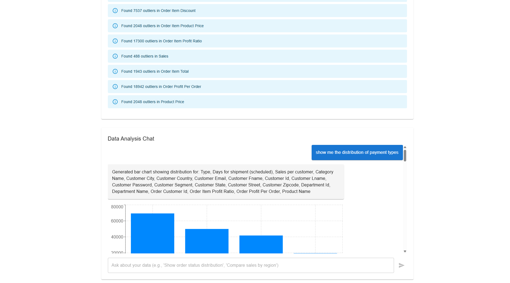
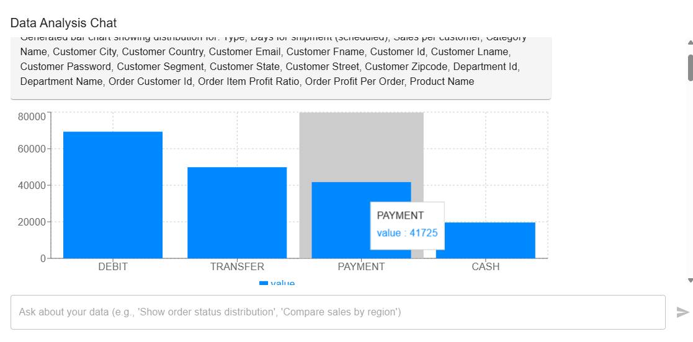
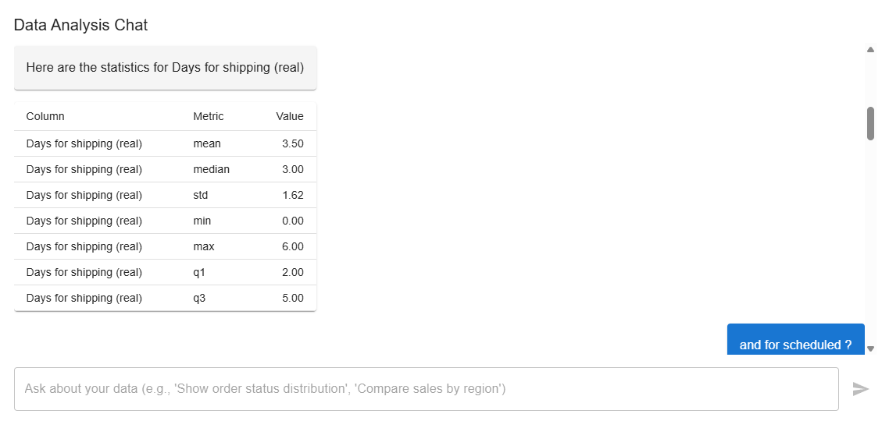
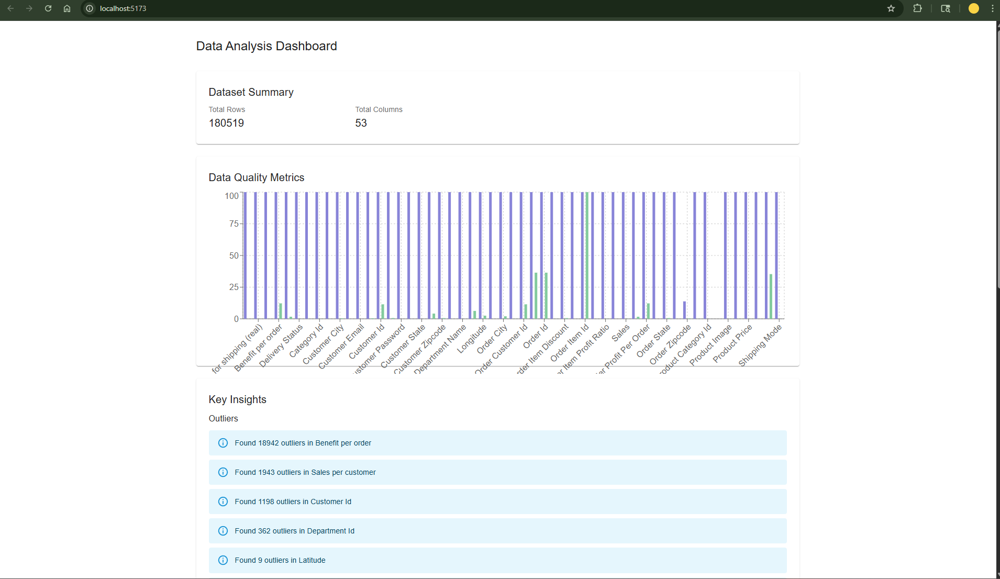
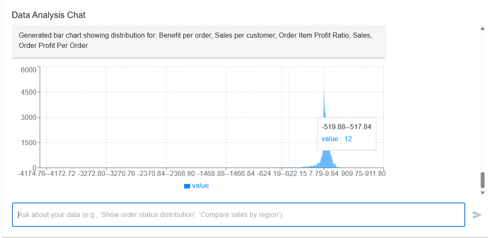

# Analyst AI 🤖

A powerful data analysis assistant powered by LangGraph and OpenAI, inspired by Julius AI. This application allows users to upload CSV and XLSX files for analysis and interact with their data through natural language conversations, making data analysis accessible to everyone.



## 🌟 Key Features

- **Intelligent File Analysis**: Support for CSV and XLSX files with automatic schema detection
- **Natural Language Interface**: Chat with your data using everyday language
- **Advanced Visualization**: Generate insightful plots and charts based on your queries
- **LangGraph ReACT Architecture**: Sophisticated reasoning and action framework for intelligent analysis
- **Human-in-the-Loop**: Verification and feedback system for critical analyses
- **Interactive Dashboard**: Real-time data exploration and visualization

### Analysis Dashboard


### Chat Interface


### Data Visualization


### File Upload Interface


## 🏗️ Project Structure

```
Analyst_AI/
├── backend/
│   ├── app/
│   │   ├── main.py          # FastAPI application entry point
│   │   └── routes.py        # API route definitions
│   ├── agents/
│   │   └── analyst_agent.py # LangGraph agent implementation
│   ├── utils/              # Utility functions and helpers
│   └── tests/              # Test suite
└── frontend/
    ├── src/
    │   ├── components/     # React components
    │   └── App.tsx        # Main application component
    └── (React + Tailwind components)
```

## 🚀 Setup

### Backend Setup

1. Create and activate virtual environment:
   ```bash
   python -m venv venv
   source venv/bin/activate  # On Windows: .\venv\Scripts\activate
   ```

2. Install dependencies:
   ```bash
   cd backend
   pip install -r requirements.txt
   ```

3. Set up environment variables:
   - Create a `.env` file in the backend directory
   - Add your OpenAI API key:
     ```
     OPENAI_API_KEY=your_api_key_here
     ```

4. Run the backend server:
   ```bash
   uvicorn app.main:app --reload
   ```

### Frontend Setup

1. Install dependencies:
   ```bash
   cd frontend
   npm install
   ```

2. Run the development server:
   ```bash
   npm run dev
   ```

## 🎯 Usage

1. Open the application in your browser (default: http://localhost:5173)
2. Enter your OpenAI API key in the settings panel
3. Upload a CSV or XLSX file using the file upload interface
4. Start analyzing your data through natural language queries!

### Example Queries
- "Show me a summary of the dataset"
- "Create a bar chart of sales by region"
- "What are the top 5 performing products?"
- "Calculate the correlation between price and quantity sold"

## 🔌 API Endpoints

- `POST /api/init`: Initialize a new analysis session
  - Returns: `session_id` for subsequent requests
- `POST /api/upload/{session_id}`: Upload a data file
  - Supports: CSV, XLSX formats
- `POST /api/chat/{session_id}`: Send a message to the analyst
  - Handles: Natural language queries and commands
- `DELETE /api/session/{session_id}`: End an analysis session
  - Cleans up resources and temporary files

## 🛠️ Technology Stack

- **Backend**:
  - FastAPI for high-performance async API
  - LangGraph for ReACT architecture
  - Pandas for data manipulation
  - Plotly and Seaborn for visualization
  - OpenAI for natural language processing

- **Frontend**:
  - React 18+ with TypeScript
  - Tailwind CSS for styling
  - Vite for fast development
  - React Query for state management

## 🤝 Contributing

1. Fork the repository
2. Create your feature branch (`git checkout -b feature/AmazingFeature`)
3. Commit your changes (`git commit -m 'Add some AmazingFeature'`)
4. Push to the branch (`git push origin feature/AmazingFeature`)
5. Open a Pull Request

## 📝 License

This project is licensed under the MIT License - see the LICENSE file for details.

## 🙏 Acknowledgments

- Inspired by Julius AI
- Built with OpenAI's powerful language models
- Powered by the amazing open-source community

## 📧 Contact

For questions and support, please open an issue in the GitHub repository.

---
Made with ❤️ by Aryan Agarwal
